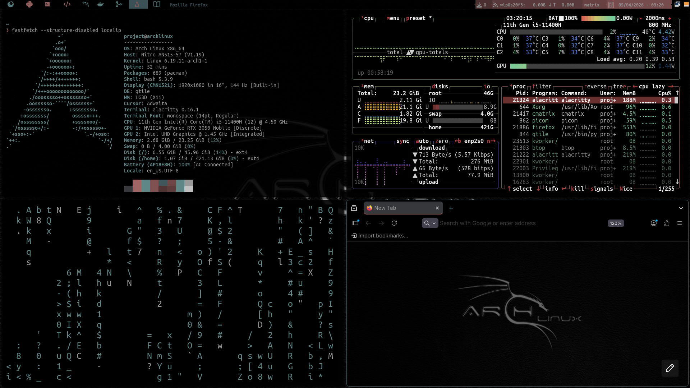

# Qtile Hacker - Dotfiles

Dotfiles para Arch Linux con Qtile como gestor de ventanas, con temas cyberpunk y metal-dark.



## Requisitos

- Arch Linux (instalado con `archinstall` o manualmente)
- Qtile instalado: `sudo pacman -S qtile`

## Instalacion

### 1. Dependencias

```bash
sudo pacman -S xorg git alacritty rofi feh picom fish --needed base-devel
```

### 2. AUR helper (yay)

```bash
git clone https://aur.archlinux.org/yay.git && cd yay && makepkg -si
```

### 3. Nerd Fonts

```bash
yay -S ttf-ubuntu-mono-nerd
```

### 4. Clonar y copiar la configuracion

```bash
git clone https://github.com/cristhian-bot0/qtile_hacker.git
cp -r qtile_hacker/qtile ~/.config/qtile
cp -r qtile_hacker/alacritty ~/.config/alacritty
cp -r qtile_hacker/rofi ~/.config/rofi
cp -r qtile_hacker/picom ~/.config/picom
cp -r qtile_hacker/fish ~/.config/fish
cp -r qtile_hacker/wallpapers ~/.config/wallpapers
cp -r qtile_hacker/gtk-3.0 ~/.config/gtk-3.0
```

### 4.1. Tema de Firefox

Copia el CSS al perfil de Firefox y habilita estilos personalizados:

```bash
FIREFOX_PROFILE=$(find ~/.config/mozilla/firefox -name "*.default-release" -type d | head -1)
mkdir -p "$FIREFOX_PROFILE/chrome"
cp qtile_hacker/firefox/userChrome.css "$FIREFOX_PROFILE/chrome/"
cp qtile_hacker/firefox/userContent.css "$FIREFOX_PROFILE/chrome/"
echo 'user_pref("toolkit.legacyUserProfileCustomizations.stylesheets", true);' >> "$FIREFOX_PROFILE/user.js"
```

Reinicia Firefox para aplicar el tema. Incluye:
- `userChrome.css` — interfaz de Firefox (barras, pestanas, URL bar) con colores metal-dark
- `userContent.css` — pagina de inicio con wallpaper kali.jpg a pantalla completa

### 5. Crear archivo de tema

El archivo `config.json` no se incluye en el repo para que cada usuario elija su tema. Crealo manualmente:

```bash
echo '{"theme": "metal-dark"}' > ~/.config/qtile/config.json
```

### 6. Cambiar shell a Fish

```bash
chsh -s /bin/fish
```

### 7. Reiniciar o iniciar sesion con Qtile

Selecciona **Qtile** en tu display manager o inicia con `startx` si usas `.xinitrc`.

## Temas

Para cambiar el tema, edita el archivo `~/.config/qtile/config.json`:

```json
{"theme": "metal-dark"}
```

Temas disponibles: `cyberpunk`, `metal-dark`.

Cada tema tiene un wallpaper recomendado. Cambia el wallpaper en `autostart.sh`:

```bash
feh --bg-scale ~/.config/wallpapers/kali.jpg &    # para metal-dark
feh --bg-scale ~/.config/wallpapers/cyberpunk.jpg & # para cyberpunk
```

> **Nota:** `autostart.sh` solo se ejecuta al iniciar sesion. Si cambias el wallpaper sin reiniciar sesion, ejecuta el comando `feh` manualmente.

## Configuracion de red

Si el widget de red no funciona, busca tu interfaz con `ip address` y editala en `qtile/settings/widgets.py`:

```python
widget.Net(**base(bg='color3'), interface='wlp2s0'),  # cambia wlp2s0 por tu interfaz
```

## Estructura

```
├── alacritty/
���   └── alacritty.toml   # Config del terminal con colores del tema
├── rofi/
│   ├── config.rasi      # Config general de rofi
│   └── metal-dark.rasi  # Tema metal-dark para rofi
├── firefox/
│   ├── userChrome.css   # Tema metal-dark para interfaz de Firefox
│   └── userContent.css  # Wallpaper en pagina de inicio
├── gtk-3.0/
│   ├── settings.ini     # Tema GTK oscuro para Thunar y apps GTK
│   └── gtk.css          # Colores metal-dark para apps GTK
├── picom/
│   └── picom.conf       # Compositor: sombras, bordes, fading, opacidad
├── fish/
│   └── config.fish      # Config de Fish shell
��── wallpapers/          # Fondos de pantalla
├── qtile/
│   ├── config.py        # Punto de entrada, autostart y variables globales
│   ├── config.json      # Tema activo (se crea manualmente)
│   ├── autostart.sh     # Programas que inician con Qtile
│   ├─�� settings/
│   │   ├── keys.py      # Atajos de teclado
│   │   ├── groups.py    # Workspaces (iconos Nerd Font)
│   │   ├── layouts.py   # Layouts disponibles (MonadTall, Bsp, Matrix...)
│   │   ├── widgets.py   # Barra con powerline y widgets
│   │   ├── screens.py   # Soporte multimonitor
│   │   ├── theme.py     # Carga de temas desde JSON
│   ���   ├── mouse.py     # Configuracion del mouse
│   │   └── path.py      # Ruta base de configuracion
│   └─�� themes/          # Temas de colores en JSON
���       ├── cyberpunk.json
│       └── metal-dark.json
└── preview.png
```

## Atajos de teclado

| Atajo | Accion |
|---|---|
| `mod + Enter` | Abrir terminal (alacritty) |
| `mod + m` | Launcher de aplicaciones (rofi) |
| `mod + shift + m` | Rofi window switcher |
| `mod + b` | Abrir navegador (firefox) |
| `mod + e` | Explorador de archivos |
| `mod + w` | Cerrar ventana |
| `mod + j/k/h/l` | Navegar entre ventanas |
| `mod + shift + j/k` | Mover ventana en la pila |
| `mod + shift + h/l` | Redimensionar ventana |
| `mod + shift + f` | Alternar flotante |
| `mod + Tab` | Siguiente layout |
| `mod + 1-9` | Cambiar de workspace |
| `mod + shift + 1-9` | Mover ventana a workspace |
| `mod + ctrl + r` | Reiniciar Qtile |
| `mod + ctrl + q` | Cerrar sesion |
| `mod + s` | Captura de pantalla |

## Solucion de problemas

### La barra aparece en modo default
Si la barra de Qtile no muestra el tema y aparece en modo default, revisa el log:

```bash
cat ~/.local/share/qtile/qtile.log | tail -20
```

Causa comun: `widget.CurrentLayoutIcon` fue removido en versiones recientes de Qtile. Este repo ya usa `widget.CurrentLayout` como reemplazo.

### El wallpaper no cambia al reiniciar Qtile
`autostart.sh` solo se ejecuta una vez al iniciar sesion (`startup_once`). Para cambiar el wallpaper sin cerrar sesion:

```bash
feh --bg-scale ~/.config/wallpapers/kali.jpg
```

### El terminal no abre con mod+Enter
Asegurate de tener `alacritty` instalado: `sudo pacman -S alacritty`

## Screenshot para r/unixporn

Para un buen screenshot, instala estas herramientas:

```bash
sudo pacman -S fastfetch cmatrix
```

Abre 3 terminales en un layout tileado:

| Ventana | Comando | Descripcion |
|---|---|---|
| Terminal 1 (izquierda) | `fastfetch` | Info del sistema con logo de Arch |
| Terminal 2 (derecha arriba) | `btop` | Monitor de sistema con colores |
| Terminal 3 (derecha abajo) | `cmatrix` | Efecto matrix / estetica hacker |

Usa `mod+shift+h/l` para ajustar tamanos y `mod+s` para capturar.

## Aplicaciones adicionales

- `cbatticon` — icono de bateria en systray
- `volumeicon` — control de volumen en systray
- [picom](https://wiki.archlinux.org/title/Picom) — compositor para transparencia, sombras y bordes redondeados
- `brightnessctl` — control de brillo
- `scrot` — capturas de pantalla
- `fastfetch` — info del sistema (recomendado para screenshots)
- `cmatrix` — efecto matrix en terminal
- `btop` — monitor de sistema

## Creditos

Basado en los dotfiles de [Antonio Sarosi](https://github.com/antoniosarosi/dotfiles).
